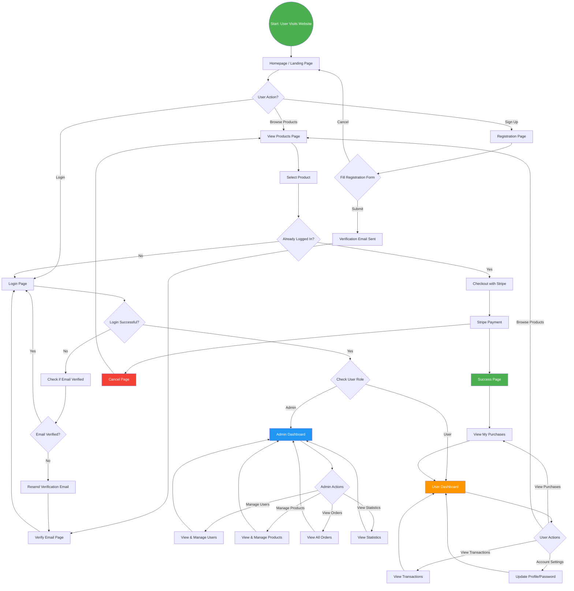

# User Onboarding Process Flow

## AA Trading Website - User Journey



---

## User Onboarding Steps

### 1. Website Visit
- User lands on the homepage
- Can browse available products without registration
- Access to public product information

### 2. Registration
- User fills registration form with:
  - Name
  - Email address
  - Password
- System validates input and checks for existing accounts

### 3. Email Verification
- Verification email sent to user's email address
- User must verify email before accessing full features
- Option to resend verification if needed

### 4. Login
- User logs in with verified email and password
- System authenticates and assigns access token
- JWT tokens manage session securely

### 5. Role Assignment
- **User Role**: Can browse products, make purchases, view orders
- **Admin Role**: Can manage users, products, orders, view statistics

---

## User Paths

### Regular User Path
```
Homepage → Browse Products → Login/Verify → Make Purchase → View Orders → Manage Account
```

### Admin User Path
```
Homepage → Login → Admin Dashboard → Manage Users/Products/Orders → View Analytics
```

---

## Key Features

### For All Users
- ✅ Browse products without registration
- ✅ Secure user authentication
- ✅ Email verification required
- ✅ Password recovery option
- ✅ Profile management

### For Customers
- ✅ Purchase products via Stripe
- ✅ View purchase history
- ✅ Access purchased content
- ✅ Track order status

### For Administrators
- ✅ Manage user accounts
- ✅ Create/update/delete products
- ✅ Monitor all orders
- ✅ View business statistics
- ✅ Update order statuses

---

## Security Features

- 🔐 JWT-based authentication
- 🔐 Refresh token mechanism
- 🔐 Password encryption (bcrypt)
- 🔐 Rate limiting on sensitive endpoints
- 🔐 Email verification required
- 🔐 CSRF protection

---

## Payment Flow

```
Select Product → Create Checkout Session → Stripe Payment → Webhook → Order Creation → Success Page
```

---

## Support Features

- 📧 Automated email notifications
- 🔄 Password reset functionality
- 💬 Floating chatbot for assistance
- 📱 Responsive design for all devices